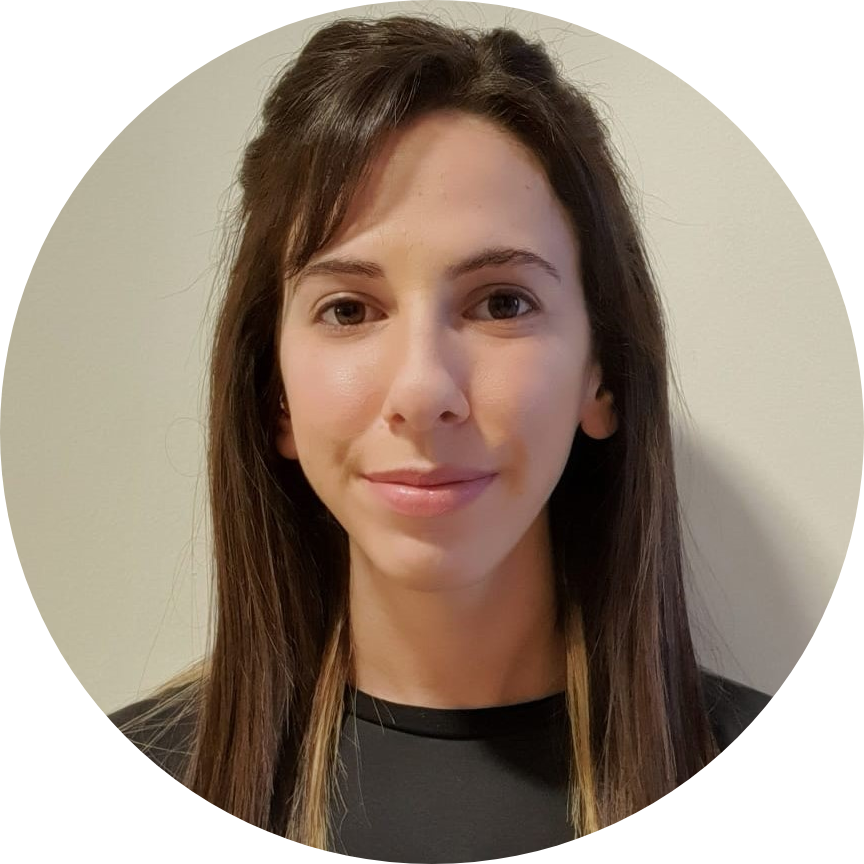

Hi there,

We hope you’re all having a fantastic week and have enjoyed the blog posts we’ve been putting out lately. We’re happy to announce that we’re back with another exciting career workshop that will appeal to philosophers interested in Tech and Risk-related careers.

This online workshop - ‘Operationalising Philosophy for Risk’ - is coming up at the beginning of next month. Here are the details:

- Wednesday, April 12th 2023
- 5 pm London Time/6 pm CET (Central European Time)
- Online on Wonder Meetings

> Our speaker for this workshop, Noam Maoz, is a Risk Prevention Specialist working in Tech for the past 6 years, currently at [Meta](https://about.meta.com/uk/) (and has been a Let’s Phi community member for a long time!). She has an MA in Philosophy of Technology from Tel-Aviv University. Over the past few years, Noam has been working to combine her passion for the Philosophy of Technology and Ethics with her roles in Risk Mitigation. Throughout her career, Noam has developed an understanding of how to leverage a non-STEM background and skill set in a Risk environment and in tech, which she will talk about in the workshop.

If this sounds like something you’d be interested in, click [here](https://forms.gle/rtoVyTt4jSv2Y1vVA) to register for the event. Registration is essential to receive a link to join the event.

[We’ve listened to your feedback regarding the platform we use to host our online events. Some of you have connection problems when it comes to using Wonder Meetings. However, we observed that it generally works well for most and it’s one of the best platforms out there where online meetings can be made more engaging and interactive. Networking is the primary reason why we organise these workshops and we don’t want to deprive you of the opportunity to network with peers and prospective mentors. That is why we’re sticking to Wonder meetings for now]

We look forward to seeing many of you there. Feel free to share the event with your friends and colleagues who might be interested in attending.

Don’t forget to visit our [website](https://www.letsphi.com/) to see all our upcoming career workshops. You can also find us on [LinkedIn](https://www.linkedin.com/company/lets-phi/?viewAsMember=true), [Facebook](https://www.facebook.com/letsphi) and [Instagram](https://www.instagram.com/letusphi/?hl=en-gb).

Best wishes,

The Let’s Phi Team.

#risk #techcareers #philosophersintech #meta #careeerworkshop #networking #networkingevent #onlineevent #letusphi #careeradvice

---

*Originally published on [Substack](https://letsphi.substack.com/p/april-workshop-operationalising-philosophy) by Ludovica Adamo.*
