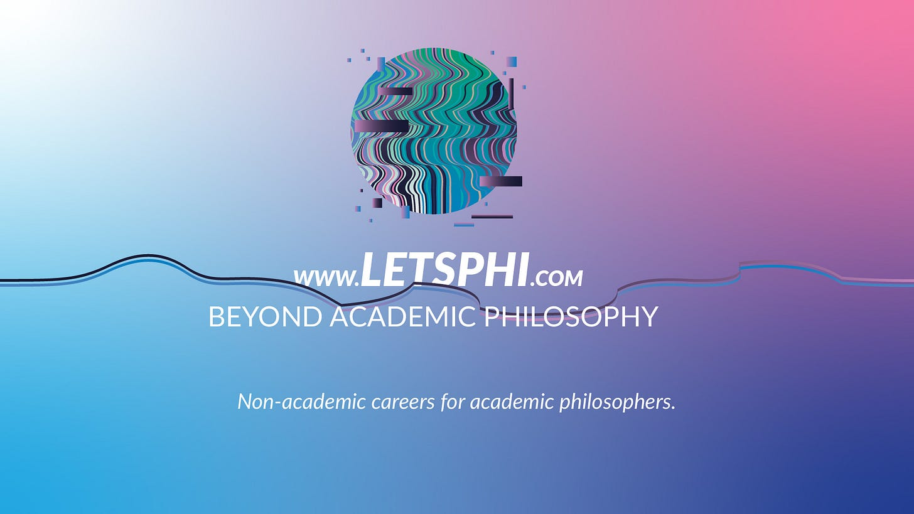

Ever asked yourself ***I've studied philosophy? Now what?!***

We're here to help. Let's Phi helps philosophers find career opportunities outside of academia. We run virtual conferences, workshops and networking events.

**We are a global community of 1800 members, 13 mentors and 4 team members.**

We help philosophers with non-academic careers. Philosophy attracts exceptionally intelligent people. It gives them great analytical skills, open-mindedness and a lot of stamina for going deep on a topic. That is, philosophy departments all over the world are great for preparing you for academic careers. However, outside of academia, it's not obvious what a philosophy graduate can do. Let's Phi helps leverage philosophy skills for non-academic careers.

Find out how to market your philosophy skills. Get inspired by hearing stories on how to build a career outside academia.

---

*Originally published on [Substack](https://letsphi.substack.com/p/coming-soon) by kkonrad.*
