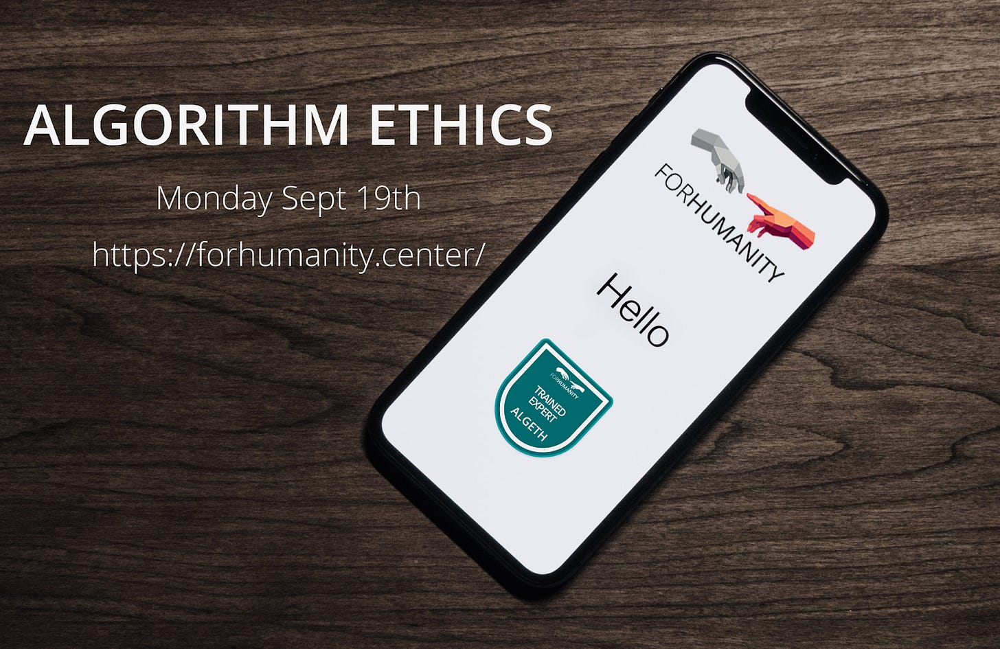

#### **Intro**

My history and philosophy undergraduate was almost over and I began thinking about the worthwhile ways I could use what I had learned. After careful consideration, I decided a degree in Digital Policy was a promising place to apply my philosophical training in an impactful way. Digital Policy is in its formative years, with topics like AI Ethics, Digital Governance, and Emergent Technologies disrupting the regulatory frameworks politicians and civil society had grown accustomed to. The malleable landscape of digital policy means many organisations and governmental groups are popping up all over the place- each offering thematically unified, but rather vague pledges to ‘inclusivity’,’ fairness’, ‘transparency.’ You know the terms, and you also know that they’re dangerous when they’re empty.

#### [ForHumanity](https://forhumanity.center/)

ForHumanity is a non-profit organisation that stood out amongst the swathe of requirements and agendas I’d been versing myself with- so much so that I became involved and wrote this piece. ForHumanity provides a framework for auditing AI Algorithmic and Autonomous (AAA) systems. It was made to ensure that the values of humans are voiced, represented, and are the determining factors between the certification and non-certification of such systems. Like financial auditing, ForHumanity establishes binary criteria for both data protection compliance and additional risk mitigation of AAA systems. ForHumanity emphasises its governmental and industry independence, as well as its aims to establish a rigorous and consistent framework within which responsibility is tractable and the values and risks of AAA systems, are clearly, and publicly disclaimed.

I can’t break down the entire auditing framework for you- you’ll just have to find out for yourselves! I can say, however, that ForHumanity embodies the principles and structure that all cynicism I cultivated throughout my degree just couldn’t withstand:

- **Inspiring, upstanding leadership-** Ryan Carrier is the founder of ForHumanity. He had his own hedge fund on wall street, but the lack of concern he witnessed upon the introduction of AAA systems, and the fear he had for their impact on his children led him to leave finance and found ForHumanity. In his one-on-one orientation to ForHumanity and its various projects, Ryan emphasised that there should be no imposter syndrome amongst the fellow members. He encouraged me to speak up and reach out, and even made a new group chat introducing me to others with similar interests. Myself and others admire his approach - he strikes a balance between being deliberate and flexible in his leadership.
- **Humility -** ForHumanity is framed off of the financial audit structure, as well as existing legislation like the GDPR. It is emphasised that despite the constant proclamation of disruptive, emergent technologies, regulators don’t need to reinvent the wheel, merely adopt what works. Further, ForHumanity makes its auditing scheme amenable to the relevant legal frameworks and cultural sensitivities. ForHumanity makes no claims as to what ‘fairness’ is independent of cultural values. In doing so it doesn’t consider itself to be a silver bullet or the deliverer of objective truth, only consistency- leading to my next point.
- **‘Proactive, not Reactive’ (- Ryan) -** Usually the only way a company knows they transgressed GDPR or other new, broad regulation is if they discover they are being sued- meaning that by that time the harm is already done. ForHumanity’s framework and requirements for compliance establishes consistency in a young field, providing a basis upon which businesses can be held accountable for AAA system risks. Further, by being a true auditing framework (unlike others you may find which serve different purposes) ForHumanity can translate broad regulation like GDPR into bite-size binary criteria a company can learn and adhere to- avoiding regulatory transgressions, therefore minimising the harms associated with AAA systems.

#### What’s ahead

ForHumanity is working closely with the UK government to have audit criteria approved as a certification scheme to ensure GDPR compliance. While certified ForHumanity auditors (FHCAs) of AAA systems are already qualified to carry out audits, official recognition by the UK will go a long way in giving ForHumanity the influence it deserves.

As well as working with the UK government, ForHumanity recently launched its Algorithm Ethics course, developed in its signature manner of crowdsourcing by a multitude of professionals. The course was made for the close inspection of algorithmic systems, and understanding of the implications of actions taken in each step of their development and implementation - each instance of Ethical Choice.

The ongoing [projects](https://forhumanity.center/bok/) are numerous and range from Cognitive Bias Remediation to Data Security Policies, to Ethics Curriculum for Designers and Developers. There are so many ways to contribute, and if Ryan catches even a whiff of interest, he will give you a project, and introduce you to professionals. You have nothing to lose.

I mentioned my previous work and interest in digital nudges and Ryan immediately put me, philosophy professors, AI ethicists and others in a group chat. As of now, we are waiting to hear back from Notre Dame’s IBM Tech Ethics Lab about a course designed to teach social media users about the various methods of nudging and how to identify them.

#### **Conclusion**

Throughout my undergraduate studies, I stopped seeing philosophy as the source of answers– instead of being a romantic journey of catharsis and discovery, philosophy became to me a tool for creating consistency. Upon further examination of the Digital Policy landscape, but really any field in the real world, I realised just how valuable consistency is as we constantly work towards a balance of efficiency and adherence to our social values and virtues – a healthy, tractable, *sustainable* kind of progress. Ultimately, I found ForHumanity to embody all of the ways in which my history and philosophy degree ought to be useful- an entity whose own ethics and foresight motivated its being in the right place at the right time.

As of now I have passed the required[foundational](https://forhumanity.center/independent-audit-of-ai-systems/) exam, and am studying to become a certified auditor in [GDPR](https://forhumanity.center/uk-gdpr/) and [Children’s Code](https://forhumanity.center/children-s-code/). It feels invigorating to put my philosophical principles into practice in an enriching way, and I will continue to be an active participant in the organisation.

I recommend you give ForHumanity a look and check out some of their resources - everything is free (except the exam, but I got a student discount) and I’m especially sure fellow philosophers can appreciate the care and profound thought inherent to the existence and functions of the entire organisation.

[This post was written by [Jennifer Waters](https://www.linkedin.com/in/jennifer-waters-42b06519b/), Writer & Collaborator @Let’s Phi, as well as a valued community member.]

Don’t forget to visit Let’s Phi [website](https://www.letsphi.com/) to see all our upcoming career workshops. You can also find us on [LinkedIn](https://www.linkedin.com/company/lets-phi/?viewAsMember=true), [Facebook](https://www.facebook.com/letsphi) and [Instagram](https://www.instagram.com/letusphi/?hl=en-gb).

Best Wishes,

The Let’s Phi Team.

#forhumanity #forhumanityuniversity #aiethics #ai #philosophydegree #letusphi #automation #learning #machinelearning #riskmitigation #philosophy #careeradvice

---

*Originally published on [Substack](https://letsphi.substack.com/p/forhumanity-embodying-everything) by Jennifer Waters.*
