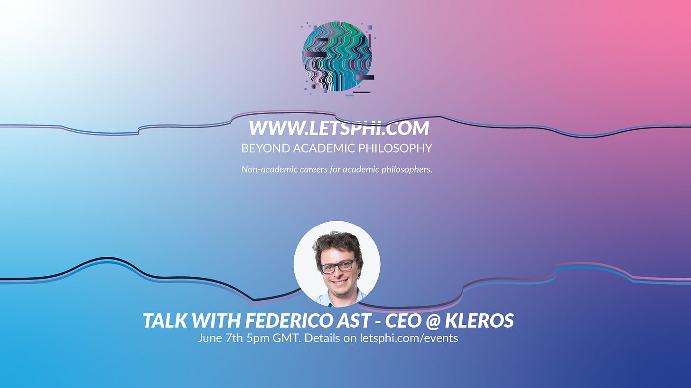

Hey!

Thanks for being part of Let’s Phi!

Our next event will be with Federico Ast, CEO of Kleros. Kleros is a decentralised dispute resolution court. It’s at the intersection of tech, epistemology, game theory, and jurisprudence. Federico studied philosophy and it clearly shows in his entrepreneurial journey. We’ll talk about the future of law, how Federico’s journey started, how he talks about his philosophy background and what he looks for in candidates (Kleros hired 30+ people).

- When? June 7th, 5pm London time (6pm CET)
- Agenda: 35 minutes talk, 15 minutes Q&A, 45 minutes networking
- [Click here for all event details and links.](https://www.letsphi.com/events)

You will receive updates right here in your inbox.

We also launched a CV and job hunting knowledge hub, if you want actionable feedback on your CV from philosophers in non-academic careers, just fill out this [form](https://forms.gle/cXjAuZKGY9fqGRVp8).

Thanks again, and please tell a few friends who are thinking about venturing into the non-academic world.

About Let’s Phi: We’re a community of academic philosophers interested in non-academic careers. We share insights, organise workshops, have mentors, networking events and conferences. We have connections across industries such as consulting, tech, media, art, finance, startups, tech, legal, government and many more.

---

*Originally published on [Substack](https://letsphi.substack.com/p/lets-phi-may-2022) by kkonrad.*
