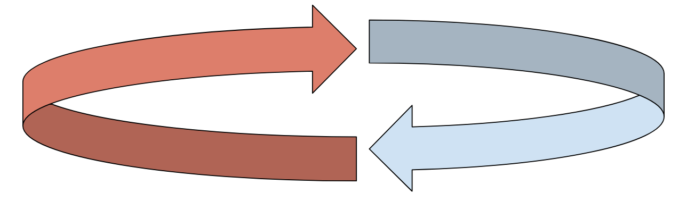

Not only is the tech discussion becoming openly philosophical, technological developments today are giving rise to new hypothetical philosophical scenarios. Rather than an introduction, there is an interplay between practical and philosophical ‘stress tests’.

As developments in the AI Ethics and Digital Governance sphere continue, aspects of philosophy are becoming increasingly explicit, rather than their former implicit presence. Developers in AI have begun asking questions like; is AI conscious?; what does moral decision-making look like? and have incorporated science-fiction outlooks in order to determine what kind of ideology they hope to adopt while developing AI.

Finally, it seems as though philosophy is getting the recognition it deserves! Ethics committees are becoming incredibly commonplace and their input is being given a much higher weight than it previously had. All of the STEM and legal professionals are crying out for the need of philosophers in order to guide the upcoming technological progress- guidance philosophers have been aching to provide for centuries. Instead of absent-minded, disconnected ‘Laputans’, philosophers are finally being considered as resourceful, insightful, and necessary. This relief of philosophers creates a harmful perception that philosophy is fixed and only needs to be introduced.

In the following sections, we aim to introduce where practical developments in AI and digital technology lend themselves as previously unthought-of hypothetical scenarios, enhancing traditional philosophical theories.

1. **Impermanence, Selfhood, and Responsibility**

The debates surrounding GDPR’s ‘right to be forgotten’ pertain to the ability for an individual to have personal data deleted from organisations and also have search engines remove links to information about an individual they consider to be irrelevant or unnecessary. The ability to have previous information deleted is a controversial capability, with some considering it essential to privacy rights, and others considering it an affront to the public interest. The cases vary, but some controversial cases, like that of the [Quinn](https://www.independent.ie/irish-news/news/right-to-be-forgotten-should-be-reviewed-by-data-protection-commission-say-civil-and-digital-rights-campaigners-41028193.html) family have led to accusations that deleting data and removing links is merely a tool to avoid responsibility.

The ability to delete data deemed unnecessary would certainly serve as a stress test to Parfit’s [continuity theory](https://www.jstor.org/stable/2184309#metadata_info_tab_contents) of personal identity. If identity and responsibility were associated with the continuity of events and aspects of an individual’s life, how would Parfit react to the ‘right to be forgotten?’ What would a debate involving Derek Parfit and GDPR look like, and how would it enhance our understanding of selfhood and responsibility? Ultimately, however, it is clear that through collaboration and dialogue between the two, philosophy would continue to develop as well.

1. **Political Postmodernism and Web 2.0**

The rise of disinformation, misinformation, and the phenomenon of ‘fake news’ has led to the adoption of Postmodernism by both liberals and conservatives (broadly speaking). With the development of Web 2.0 and content recommendation algorithms (CRAs) information has grown less trustworthy in many respects - to the extent that conservatives have begun espousing postmodernist claims. [Postmodernism](https://plato.stanford.edu/entries/postmodernism/)is a sceptical view of certain or fixed meanings, identities, binaries, hierarchies, etc. Postmodernism holds our understandings of our lives and ourselves as unstable and frequently contingent on the societies we grow up in.

Postmodernism is widely considered a liberal ‘ism’ with regard to social and gender norms and has been regarded as a derogatory term by conservatives. Suddenly, however, accusations of ‘fake news’ have led to the ‘post-truth-era’ on the conservative side of the political spectrum! In order for there to be false or fake news, there must also be true and real news, leading some individuals to believe there is no such thing as truth at all, only perspective. Whether it be from the right or left side of the political spectrum, the postmodernist theory is invoked to argue that instead of truth, there is only narrative and belief.

Such socio-political developments have led to growing philosophical investigations into [‘bullsh*t](https://philosopherscocoon.typepad.com/blog/2020/02/teaching-bullshit-and-assholes-part-1-guest-post-by-c-thi-nguyen.html)’ and [‘trolling’](https://www.cambridge.org/core/journals/journal-of-the-american-philosophical-association/article/aristotle-on-trolling/540BB557C82186C33BFFB61E35A0B5B6). The previously established relationships between intent, meaning, and overall engagement with discourse have been stressed with the rise of ‘trolling’ or ‘memeing’ in Web 2.0, leading to philosophical developments regarding these stresses.

1. **Computational Law and Jurisprudence**

The particular areas of research one of our authors (Jennifer) has begun investigating are the origins and implications of computational law on jurisprudence, including legal analytics like [Lex Machina](https://lexmachina.com/). The application of data analytics to law and legal reasoning has revived philosophical discussion regarding both the fundamental nature of legal rules as well as the importance of human decision-making. [Mireille Hildebrandt](https://lsts.research.vub.be/en/mireille-hildebrandt) in particular has published widely on the uses of AI in law as well as the role of privacy as a right in the digital age.

The codification of legal rules and legal reasoning seems to have originated from a strain of legal positivism emphasising the ‘facticity’ of law rather than its [‘meritoriousness](https://plato.stanford.edu/entries/legal-positivism/).’ The regard to law as a fact-based system would lend itself to an [algorithmic](https://papers.ssrn.com/sol3/papers.cfm?abstract_id=3407856) approach to legal decision making. How would someone like H.L.A. Hart respond to automated, data-driven legal reasoning? Is a ‘robot judge’ compatible with the original ambitions of positivism? Such questions test our existing conceptions of jurisprudence, as well as our ability to improve our existing justice systems virtuously.

#### Conclusion

While we all know the trope of short-sighted, ideological engineers or entrepreneurs and their adversary, the wise, hesitant philosophers, however, we believe the developments in AI and digital governance don’t establish an introduction of philosophy to technological developments, but a developmental interplay between the two. Where philosophical arguments are introduced to stress test developing AI and digital governance, the scenarios they apply to may themselves stress test the robustness of philosophical theories.

[This post was written by [Jennifer Waters](https://www.linkedin.com/in/jennifer-waters-42b06519b/) and [Ismael Kherroubi Garcia](https://www.linkedin.com/in/ismaelkherroubi/), Writers & Collaborators @Let’s Phi, as well as valued community members.]

Don’t forget to visit Let’s Phi [website](https://www.letsphi.com/) to see all our upcoming career workshops. You can also find us on [LinkedIn](https://www.linkedin.com/company/lets-phi/?viewAsMember=true), [Facebook](https://www.facebook.com/letsphi) and [Instagram](https://www.instagram.com/letusphi/?hl=en-gb).

Best Wishes,

The Let’s Phi Team.

#technology #philosophy #collaboration #stresstest #gdpr #righttobeforgotten #responsibility #postmodernism #wen2.0

---

*Originally published on [Substack](https://letsphi.substack.com/p/mutual-stress-tests) by Ismael Kherroubi Garcia, Jennifer Waters.*
