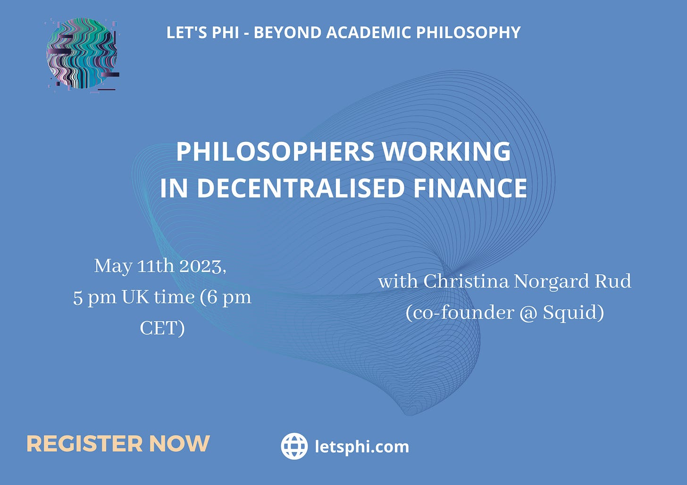

Hi there,

We hope you’re all having a fantastic week.

There’s still time to register for our upcoming online workshop on Decentralised Finance. Here are the details:

- Thursday, May 11th 2023
- 5 pm London Time/6 pm CET (Central European Time)
- Online on Gather

> Our speaker for this workshop, Christina Norgard Rud, is the co-founder of [Squid](https://www.squidrouter.com/), a De-Fi startup. She has a background in International Management (B.Sc at Alliance Manchester Business School) and Philosophy & Public Policy (MSc at the London School of Economics). Christina is going to talk about working in Web3 and decentralised finance with a philosophy background, and the important skills her philosophy degree provided that she uses everyday at work. **She will also share info on the process of co-founding a start-up, fundraising, and navigating the ever-evolving space of Web3**.

REGISTER NOW at [this link](https://forms.gle/ki2CDTq9rNrLVHZb8).

We look forward to seeing many of you there. Feel free to share the event with your friends and colleagues who might be interested in attending.

Don’t forget to visit our [website](https://www.letsphi.com/) to see all our upcoming career workshops. You can also find us on [LinkedIn](https://www.linkedin.com/company/lets-phi/?viewAsMember=true), [Facebook](https://www.facebook.com/letsphi) and [Instagram](https://www.instagram.com/letusphi/?hl=en-gb).

Best wishes,

The Let’s Phi Team.

#defi #decentralisedfinance #web3 #fundraising #cofounding #startup #web3startup #web3work #networking #careerevent #onlineevent #networkingevent #careeradvice #careerworkshop #philosophydegree #letusphi

---

*Originally published on [Substack](https://letsphi.substack.com/p/theres-still-time-to-register-7b1) by Ludovica Adamo.*
