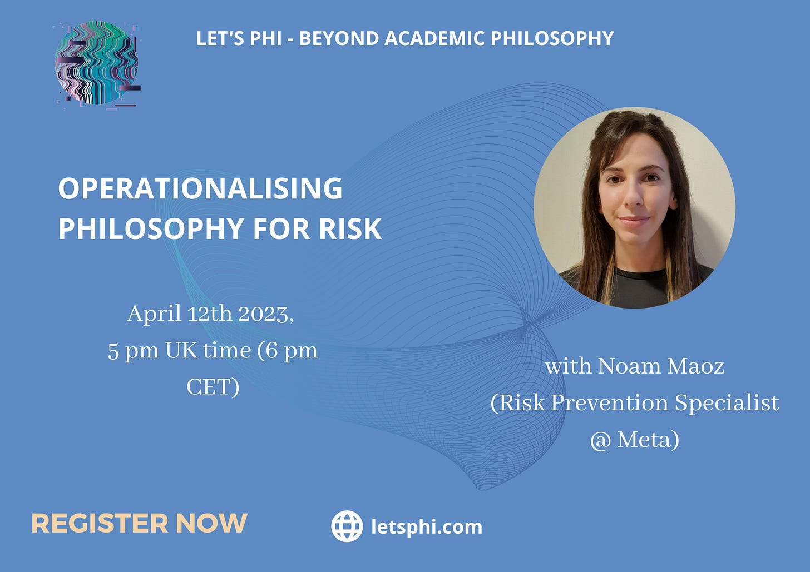

Hi there,

There’s still time to register for our April Workshop on Operationalising Philosophy for Risk.

Here are the details:

- **Wednesday, April 12th 2023**
- **5 pm London time/ 6 pm CET (Central European Time)**
- **Online on Wonder Meetings**

> Our speaker for this workshop, Noam Maoz, is a Risk Prevention Specialist working in Tech for the past 6 years, currently at [Meta](https://about.meta.com/uk/) (and has been a Let’s Phi community member for a long time!). She has an MA in Philosophy of Technology from Tel-Aviv University. Over the past few years, Noam has been working to combine her passion for the Philosophy of Technology and Ethics with her roles in Risk Mitigation. Throughout her career, Noam has developed an understanding of how to leverage a non-STEM background and skill set in a Risk environment and in tech, which she will talk about in the workshop.

Click [here](https://forms.gle/rtoVyTt4jSv2Y1vVA) to register for the event. Registration is essential to receive a link to join the event.

Don’t forget to visit our [website](https://www.letsphi.com/) to see all our upcoming career workshops. You can also find us on [LinkedIn](https://www.linkedin.com/company/lets-phi/?viewAsMember=true), [Facebook](https://www.facebook.com/letsphi) and [Instagram](https://www.instagram.com/letusphi/?hl=en-gb).

We look forward to seeing many of you there.

Best wishes,

The Let’s Phi Team.

#risk #techcareers #philosophersintech #meta #careeerworkshop #networking #networkingevent #onlineevent #letusphi #careeradvice

---

*Originally published on [Substack](https://letsphi.substack.com/p/theres-still-time-to-register-d76) by Ludovica Adamo.*
